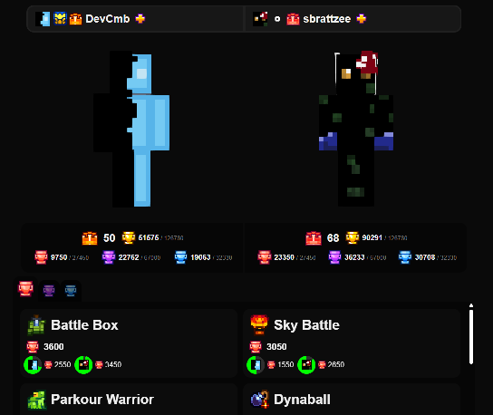
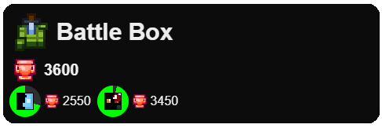
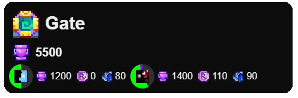

# MCC Island Player Compare 
*A simple website for comparing MCC Island statistics*

The live website can be found at https://islandcompare.devcmb.xyz/

Go play mcc island!!! `play.mccisland.net` minecraft java 1.21.8+

## Features
The website displays all the trophies of both players for side-by-side comparing.

Below the trophy comparison box, another menu can be found where you can compare skill trophies (red) and style trophies (purple). Fishing comparison is coming soon™️

In this menu, it shows the total trophies for the game/collection, as well as the player's trophy amount and a pie chart showing their progress to completion

For the style tab, it also shows their royal reputation percentage, both in the pie chart and player section, as well as their chromas

## Development
To contribute to this project, you will need the following credentials
- A noxcrew API key (generated [here](https://gateway.noxcrew.com))
- An upstash URL and token (ratelimiting)

Rename the `.env.dist` to `.env` or `.env.local` and fill in the empty fields with the credentials found above.

## Contributing
Contributions are welcome! If you have anything you'd like to add or change, feel free to fork and make a pull request.